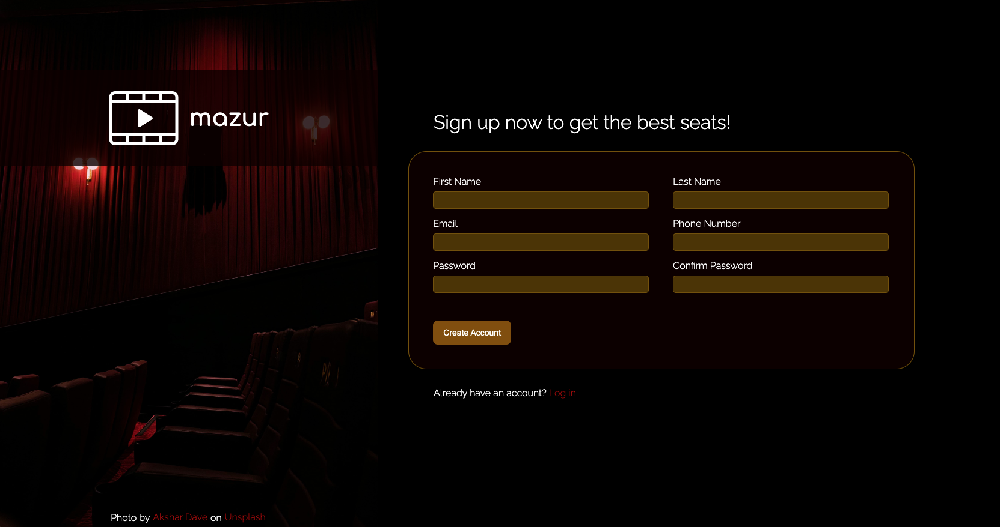

# Sign-up Form

Sign-up form for cinema booking service.

[Check live](https://mrzadzinski.github.io/sign-up-form/)

## Features
* Client-side form validation (using input type and 'pattern' HTML attribute)
  * At least 2 letters for first and last name
  * At least 1 capital letter, 1 lower case letter, 1 number and minimum 8 characters for password
* Password match check and generated error message (JavaScript)

## Technologies
* CSS
  * SASS preprocessor using .scss syntax
  * Flexbox
* HTML
* Javascript

## Skills practiced
* Client-side form creation
* CSS
  * Resizing elements with clamp() function
  * Advanced selectors
  * Pseudo-classes
  * SASS with .scss syntax
    * variables
    * nesting

## Acknowledgments
* This project was an assignment from The Odin Project course:
  * [Sign-Up Form](https://www.theodinproject.com/lessons/node-path-intermediate-html-and-css-sign-up-form)
